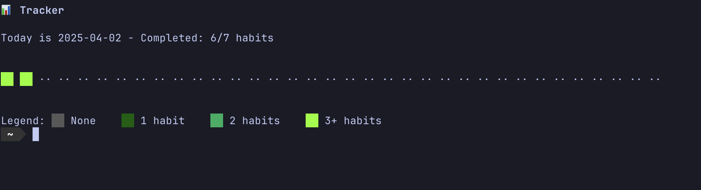
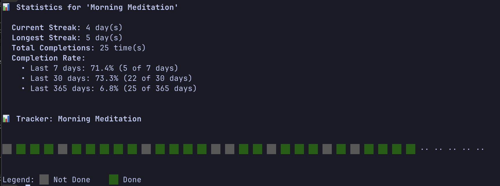
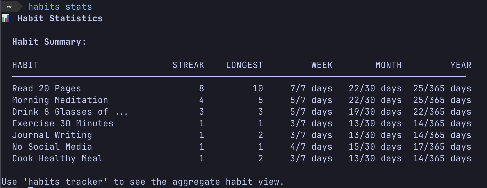
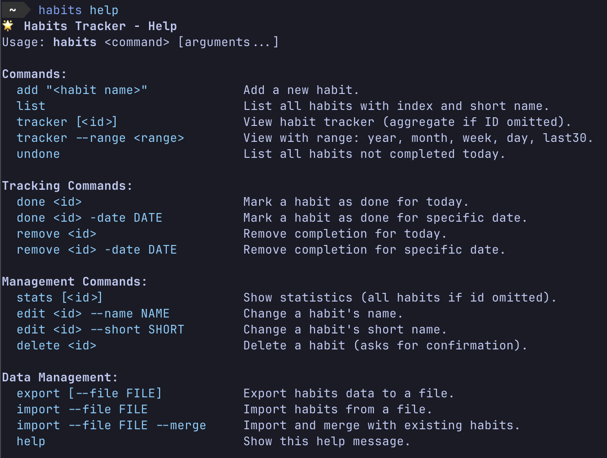

# Habits CLI

A simple command-line habit tracker that helps you build and maintain daily habits.

## Screenshots

### Main Habit Grid (Month View)


*Monthly view of all habit completions*

### Habit List


*List of all tracked habits*

### Single Habit Detail


*Detailed view of a single habit's tracking*

### Statistics View


*Completion statistics and streaks*

### Command Help


*Available commands and usage*

## Features

- Track multiple habits from the command line
- View your habits in a visual grid by day, week, month, or custom ranges
- Get statistics on your streaks and completion rates
- Import and export your data
- Minimal and fast interface

## Installation

### Using the install script

```bash
# Clone the repository
git clone https://github.com/yourusername/habit-cli.git
cd habit-cli

# Run the installation script
chmod +x install.sh
./install.sh
```

The install script will:

1. Build the binary
2. Install it to `~/.local/bin/`
3. Add this directory to your PATH if using fish shell
4. Provide instructions for other shells

### Manual installation

```bash
# Clone the repository
git clone https://github.com/yourusername/habit-cli.git
cd habit-cli

# Build the binary
go build -o habits habits.go

# Move it to a directory in your PATH
mv habits /usr/local/bin/  # or another directory in your PATH
```

## Usage

```
habits [command] [args]
```

### Basic Commands

- `habits list` - List all your tracked habits
- `habits add "Habit Name"` - Add a new habit to track
- `habits done <habit>` - Mark a habit as completed for today
- `habits delete <habit>` - Delete a habit from tracking
- `habits tracker [habit]` - View habit tracker (for a specific habit or all habits)
- `habits stats [habit]` - Show statistics about your habits

### Advanced Commands

- `habits export --file <filename>` - Export your habits data to JSON
- `habits import --file <filename>` - Import habits data from JSON
- `habits edit <habit> --name "New Name"` - Edit a habit's name
- `habits undone` - List habits not completed today

Run `habits help` to see all available commands.

## Demo Data

To try the application with sample data, you can use the included seed file:

```bash
# Import the seed data
habits import --file seed_data.json
```

## License

MIT
